# lucebox-BUILDER (CUDA 12 & AMD ROCm™ 7)

<div align="center">

[](https://github.com/Heretek-AI/lucebox-BUILDER/releases/latest)
[](LICENSE)
[](https://developer.nvidia.com/cuda-toolkit)
[](https://github.com/ROCm/ROCm)
[](#-supported-devices)
[](#-supported-devices)

<p align="center">
  <b>High-performance automated nightly and on-demand builds of <a href="https://github.com/Luce-Org/lucebox">lucebox</a> (DFlash inference server) with built-in CUDA 12.8 & AMD ROCm™ 7 runtime libraries.</b>
</p>

</div>

---

## ⚡ Project Overview

**lucebox** ([`Luce-Org/lucebox`](https://github.com/Luce-Org/lucebox)) is a high-performance inference engine for **DeepSeek-V4, DeepSeek-V3, and DFlash architectures**, featuring flash-prefill, speculative decoding, continuous batching, and low-latency KV cache management.

This repository (`Heretek-AI/lucebox-BUILDER`) delivers turnkey, relocatable binary releases with embedded runtime libraries and `$ORIGIN` RPATHs — **zero host CUDA/ROCm installations required**.

```mermaid
flowchart LR
    subgraph Toolchains ["Multi-Backend Toolchains"]
        C1["NVIDIA CUDA 12.8<br/>Fat Binary (sm_75 - sm_120)"]
        C2["AMD ROCm 7 Nightlies (TheRock)<br/>(gfx1151, gfx1100, gfx1201)"]
    end

    subgraph Builder ["lucebox-BUILDER Pipeline"]
        B1["Automated Nightly CI (13:00 UTC)"]
        B2["$ORIGIN RPATH Dynamic Bundler"]
        B3["Non-Blocking Hardware Smoke Tests"]
    end

    subgraph Releases ["Turnkey Binary Releases"]
        R1["lucebox-b####-linux-cuda12-x64.zip"]
        R2["lucebox-b####-linux-rocm-gfx1151-x64.zip"]
        R3["lucebox-b####-linux-rocm-gfx1100-x64.zip"]
        R4["lucebox-b####-linux-rocm-gfx1201-x64.zip"]
    end

    Toolchains --> Builder --> Releases
```



---

## 🎯 Supported Hardware Matrix

Every release ships Linux x86_64 zip packages. ROCm archives bundle all essential shared libraries (`libamdhip64`, `librocblas`, `libhipblas`, `libhipblaslt`, `.kpack`, Tensile blobs) with `$ORIGIN` RPATH:

| Asset Name | Backend | Target Architecture & Devices |
|---|---|---|
| `lucebox-${TAG}-linux-cuda12-x64.zip` | **CUDA 12.8 Fatbin** | `sm_75`, `sm_80`, `sm_86`, `sm_89`, `sm_90`, `sm_120` (RTX 2080 Ti → RTX 3090 / 4090 / 5090, A100, H100) |
| `lucebox-${TAG}-linux-rocm-gfx1151-x64.zip` | **AMD HIP / ROCm 7** | **AMD Strix Halo APU** (Ryzen AI MAX+ Pro 395 / Radeon 8060S / 128GB Unified Memory) |
| `lucebox-${TAG}-linux-rocm-gfx1100-x64.zip` | **AMD HIP / ROCm 7** | **AMD RDNA3 Discrete GPUs** (Radeon RX 7900 XTX / 7900 XT / 7800 XT) |
| `lucebox-${TAG}-linux-rocm-gfx1201-x64.zip` | **AMD HIP / ROCm 7** | **AMD RDNA4 Discrete GPUs** (Radeon AI PRO R9700, RX 9070 XT / 9070) |

---

## 📦 Quick Start

```bash
# 1. Download and extract target archive from GitHub Releases
unzip lucebox-b1000-linux-rocm-gfx1151-x64.zip -d lucebox
cd lucebox/bin

# 2. Launch DFlash inference server
./dflash_server /path/to/DeepSeek-V4-Flash.gguf --port 8080 --host 0.0.0.0

# 3. Speculative decoding with draft model
./dflash_server main_model.gguf --draft draft_model.gguf --port 8080
```

---

## 🚀 CI Workflows

[`.github/workflows/build-lucebox.yml`](.github/workflows/build-lucebox.yml):
- **Nightly cron** at 13:00 UTC, plus manual `workflow_dispatch` (configurable CUDA arches, gfx targets, ROCm version, and rocWMMA Phase-2 kernels).
- **TheRock ROCm Toolchain**: Downloads nightly multi-arch tarballs from AMD's official distribution mirrors.
- **CUDA 12.8 Toolchain**: Builds fat binaries covering compute capabilities from Turing (`sm_75`) through Blackwell (`sm_120`).
- **Self-Hosted Smoke Tests**: Non-blocking verification on live GPU hardware.

---

## 📄 License & Attribution

- **lucebox**: Developed by Luce Org ([Luce-Org/lucebox](https://github.com/Luce-Org/lucebox)) under the MIT License.
- **lucebox-BUILDER Pipeline**: Developed by Heretek-AI under the MIT License.
